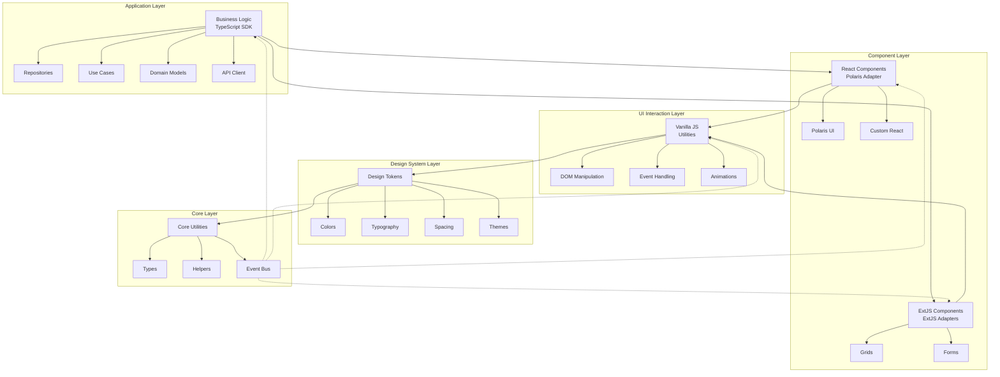
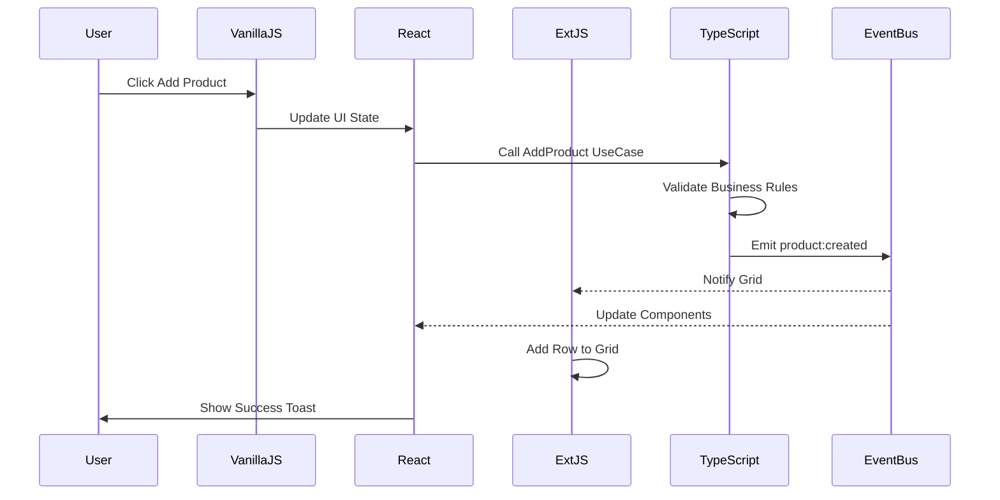
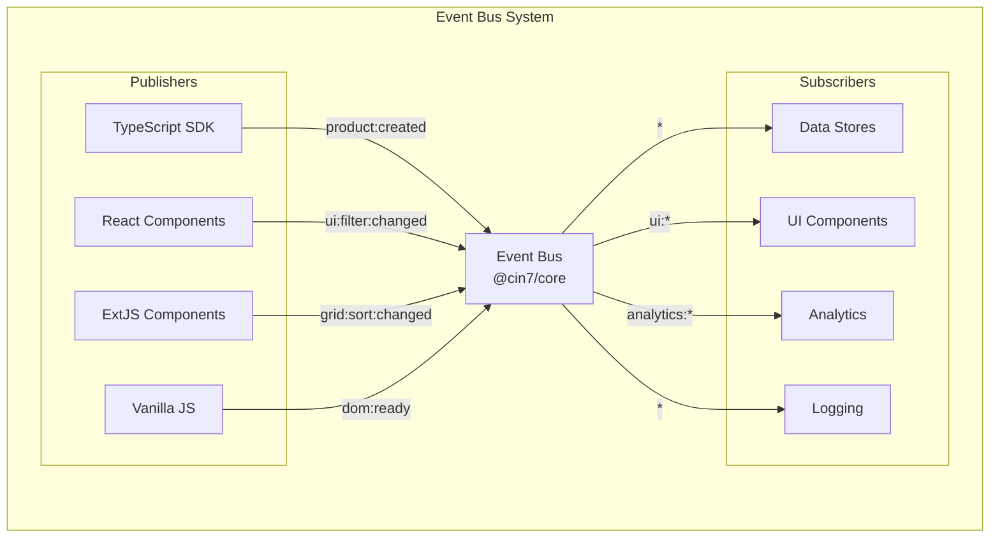
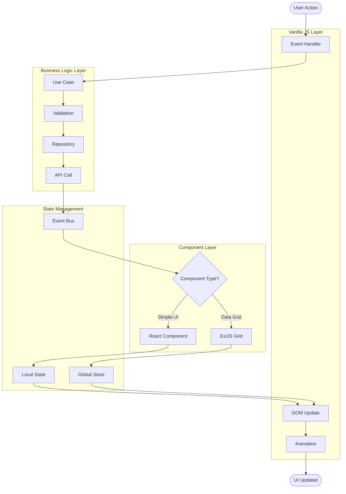

# Cin7 DSL Architecture Diagram

## System Architecture Overview



## Layer Communication Flow



## Package Dependencies

```mermaid
graph LR
    subgraph "Framework Packages"
        CORE[@cin7/core]
        TOKENS[@cin7/design-tokens]
        VANILLA[@cin7/vanilla-js]
        REACT[@cin7/polaris-adapter]
        EXTJS[@cin7/extjs-adapters]
        SDK[@cin7/typescript-sdk]
        CLI[@cin7/cli]
    end
    
    subgraph "External Dependencies"
        POLARIS[Shopify Polaris]
        EXT[ExtJS Framework]
        TS[TypeScript]
        REACTLIB[React]
    end
    
    VANILLA --> CORE
    REACT --> CORE
    REACT --> TOKENS
    REACT --> POLARIS
    REACT --> REACTLIB
    EXTJS --> CORE
    EXTJS --> TOKENS
    EXTJS --> EXT
    SDK --> CORE
    SDK --> TS
    TOKENS --> CORE
    CLI --> CORE
```

## Technology Stack by Layer

| Layer | Technology | Purpose | Package |
|-------|------------|---------|---------|
| **Business Logic** | TypeScript | Type-safe business operations | `@cin7/typescript-sdk` |
| **React Components** | React + Polaris | Modern UI components | `@cin7/polaris-adapter` |
| **ExtJS Components** | ExtJS 7.x | Enterprise grids & forms | `@cin7/extjs-adapters` |
| **UI Interactions** | Vanilla JavaScript | Lightweight DOM manipulation | `@cin7/vanilla-js` |
| **Design System** | CSS Custom Properties | Consistent styling | `@cin7/design-tokens` |
| **Core Utilities** | TypeScript | Shared functionality | `@cin7/core` |

## Event-Driven Architecture



## Implementation Example Flow



## Benefits of This Architecture

### 1. **Technology Optimization**
- Right tool for each job
- ExtJS for complex enterprise components
- React for modern UI patterns
- Vanilla JS for performance-critical operations

### 2. **Maintainability**
- Clear separation of concerns
- Independent package updates
- Consistent patterns across layers

### 3. **Scalability**
- Modular package structure
- Event-driven communication
- Independent deployment options

### 4. **Developer Experience**
- TypeScript throughout
- Consistent APIs
- Comprehensive tooling

### 5. **Performance**
- Minimal dependencies
- Tree-shakeable packages
- Optimized bundle sizes

## Usage Patterns

### Pattern 1: Simple UI Interaction
```javascript
// Vanilla JS handles simple interactions
import { $, on, addClass } from '@cin7/vanilla-js';

on('#button', 'click', () => {
  addClass('#panel', 'active');
});
```

### Pattern 2: Business Operation
```typescript
// TypeScript handles business logic
import { ProductRepository } from '@cin7/typescript-sdk';

const repo = new ProductRepository();
const products = await repo.findAll({ status: 'active' });
```

### Pattern 3: Enterprise Grid
```javascript
// ExtJS handles complex grids
import { ExtDataGrid } from '@cin7/extjs-adapters';

const grid = ExtDataGrid.create({
  store: productStore,
  features: ['grouping', 'sorting', 'export']
});
```

### Pattern 4: Cross-Layer Communication
```typescript
// Event Bus enables decoupled communication
import { EventBus } from '@cin7/core';

EventBus.on('product:updated', (product) => {
  // All layers can react to this event
});
```